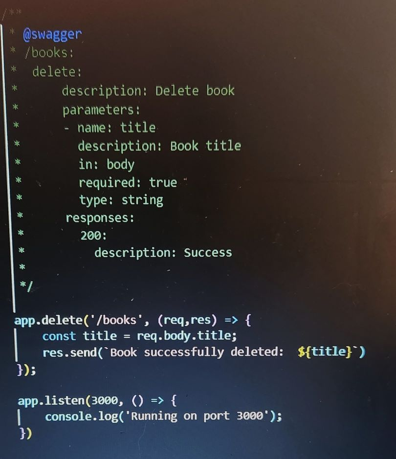

# Swagger UI

## How to Write API Requests

In order to create API requests, the decription of the intended request must be properly written through <b>Swagger</b> specifications.

In the <b>DELETE</b> example above, you'll notice that even before the code for the request is written, the <b>Swagger</b> structure is called by @swagger. 

The parameters that follow include the <i>route</i> ('/books'), the <i>HTTP verb</i> (delete), a complete description of the purpose and desired outcome. In this case we want to be able to delete a book from the database by name. This is written as the <u>parameters of the request body</u> indicated in the example above and below. 

And voi-la! All you need to do is boogy to your localhost (<b>localhost:3000/api-docs</b> in this case) and play around with different requests!
